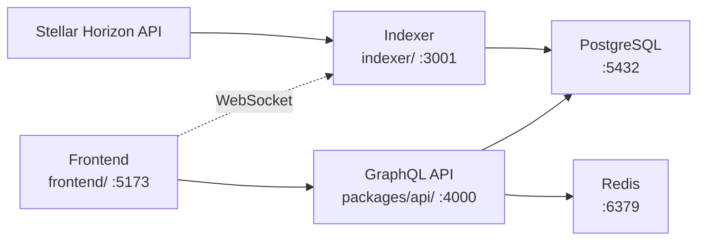
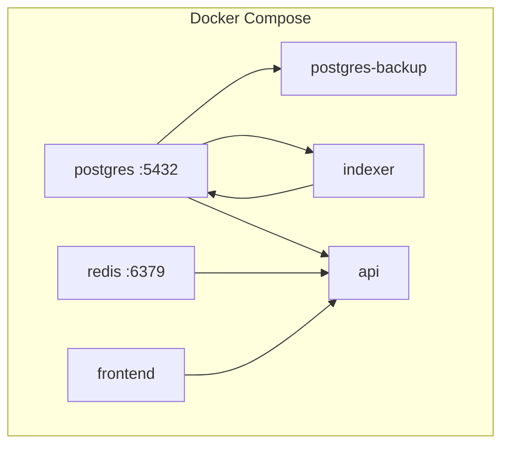

# Architecture Overview

System architecture and canonical package paths for the Stroop monorepo.

**Workspace authority:** `pnpm-workspace.yaml`

---

## Canonical Package .

The monorepo uses a mixed layout. Always use these paths when editing code or documentation:

| Package | Canonical path | pnpm filter | Notes |
|---------|---------------|-------------|-------|
| Indexer (runtime) | `indexer/` | `@stroop/indexer` | Active source and `.env` |
| Indexer migrations | `packages/indexer/migrations/` | — | SQL migrations (not in workspace) |
| GraphQL API | `packages/api/` | `@stroop/api` | |
| Frontend (dev) | `frontend/` | `@stroop/frontend` | Vite dev server |
| Shared types | `shared/` | `@stroop/shared` | |
| E2E tests | `packages/e2e/` | `@stroop/e2e` | Playwright |
| ESLint rules | `tools/eslint-rules/` | `@stroop/eslint-plugin` | |

**Legacy duplicates (do not use for new work):**

| Path | Status |
|------|--------|
| `api/` | Legacy API copy; use `packages/api/` |
| `packages/frontend/` | GraphQL lint hooks only; dev server runs from `frontend/` |
| `packages/indexer/` | Migrations only; runtime is `indexer/` |
| `packages/shared/` | Unused duplicate; use `shared/` |

---

## System Architecture

### Data Flow

1. **Indexer** polls Stellar Horizon, transforms ledger data, and writes to PostgreSQL.
2. **API** serves GraphQL queries from PostgreSQL with Redis caching and rate limiting.
3. **Frontend** renders the React dashboard, fetching data via Apollo Client.

### Technology Choices

| Component | Technology | Rationale |
|-----------|-----------|-----------|
| Monorepo | pnpm workspaces + TypeScript | Shared types, unified tooling |
| Persistence | PostgreSQL 16 | Relational ledger/transaction data |
| Cache | Redis 7 | Query caching, rate limiting, pub/sub |
| API | Apollo Server (GraphQL) | Flexible dashboard queries |
| Frontend | React + Vite | Fast HMR, modern SPA |
| Indexer | Node.js + Stellar SDK | Horizon streaming and batch processing |

---

## Deployment Architecture

| Service | Port | Volumes |
|---------|------|---------|
| PostgreSQL | 5432 | `postgres-data`, WAL archive |
| Redis | 6379 | — |
| Indexer health | 3001 | — |
| GraphQL API | 4000 | — |
| Frontend (dev) | 5173 | — |

Backup architecture: daily dumps via `postgres-backup` service, WAL archiving enabled, retention configurable via `BACKUP_RETENTION_DAYS`. See `docs/backup-disaster-recovery.md`.

---

## Related Documentation

| Document | Content |
|----------|---------|
| `docs/environment-variables.md` | All environment variables |
| `docs/database-migrations.md` | Migration workflow |
| `docs/incident-response-runbook.md` | Incident response procedures |
| `docs/backup-disaster-recovery.md` | Backup and PITR |
| `DEVELOPMENT.md` | Local setup guide |
